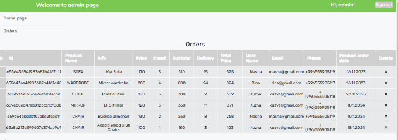

# Проект "Furniking-shop"

 Добро пожаловать в "Furniking-shop",онлайн-магазин мебели! Это проект, который был создан в рамках самообразования и закрепления полученных знаний.

 #### Для запуска использовать команды

 npm run start

## Цель проекта

 Целью проекта было закрепление полученных знаний по React.js, а также развитие практических навыков веб-разработки. Создание онлайн магазина мебели позволило применить изученные концепции React.js на практике и лучше понять принципы разработки веб-приложений.

## Технологии

 Фронтенд для этого проекта построен с использованием React JS с использованием функционального подхода. Для управления состоянием и получения данных используются контекст и REST API. Разметка семантическая и следует соглашениям по именованию БЭМ. Верстка выполнена с использованием Grid Flex, и сайт полностью адаптивен.Это обеспечивает высокое качество изображений при любом масштабировании и быструю загрузку страницы.

## Функциональность

 Сайт позволяет пользователям просматривать мебельные товары, разделенные на категории. Для поиска конкретных товаров доступна функция поиска. Кроме того, сайт позволяет пользователям приблизить изображения товаров для    более детального просмотра. Это многофункциональный сайт с несколькими страницами, на которых пользователи могут читать и оставлять отзывы, добавлять товары в список пожеланий и в корзину покупок. Чтобы оформить заказ, пользователь должен зарегистрироваться, после чего заказ можно разместить.

#### Формат изображений

 Изображения, используемые на сайте, представлены в форматах SVG и PNG.

#### Мобильная совместимость

 Сайт адаптирован для просмотра на мобильных устройствах, что обеспечивает удобство использования сайта пользователями с различными устройствами и экранами.

#### Личный кабинет

 Наличие личного кабинета позволяет пользователям хранить информацию о своих заказах, отмечать понравившиеся товары и управлять своими данными. Это делает сайт более удобным для повторных покупок и удержания пользователей.

#### Функционал отзывов

 Сайт предоставляет возможность пользователям оставлять отзывы о товарах, что помогает другим пользователям принимать решение о покупке на основе реальных отзывов.

#### Безопасность

 При оформлении заказа и регистрации пользователей на сайте используются средства шифрования, что обеспечивает защиту персональных данных пользователей и безопасность при совершении покупок.

#### Интеграция с социальными сетями

 Сайт предоставляет возможность пользователям делиться понравившимися товарами с друзьями через социальные сети, что способствует увеличению трафика на сайте и привлечению новых пользователей.

## Бэкенд
 Бэкенд является серверной частью интернет-магазина. Он обрабатывает запросы, поступающие от фронтенда, взаимодействует с базой данных для получения информации о товарах и пользователях, обеспечивает работу корзины покупок, обработку платежей и другие функции, необходимые для функционирования интернет-магазина.

 Бекенд для этого проекта написан на express.js, база данных MongoDB.

 * * [Ссылка на бэкенд](https://github.com/20Maribel22/express-furniking-shop)

## Административная панель

 Сайт, в дополнение к основному интерфейсу, также содержит административную панель. Администратор получает доступ к ней при помощи уникального логина и пароля, хранящихся в базе данных. По входу в систему, администратор перенаправляется на страницу админки, где доступен общий функционал и правила управления. В меню администратора находятся разделы для управления заказами, товарами и пользователями. Каждая страница содержит табличные данные с возможностью добавления, редактирования и удаления товаров, а также быстрый поиск по необходимым товарам. Для безопасности сайта,административная панель скрыта от пользователей.

 ## Для ознакомления с функциональностью предоставлены скриншоты:

 #### Перенаправление на главную страницу сайта

  

 #### Перенаправление на главную страницу администратора

   Перенаправление на главную страницу администратора происходит по клику по той же иконке,что и при входе в личный кабинет пользователя.

   

#### Выгрузка всех товаров

   

   Продолжение

   ")

  #### Добавление нового товара

   По клику на кнопку "add product" появляется форма для заполнения полей,которая поволяет добавить новый товар.

   

   #### Поиск товара

   

   Продолжение
   
   ")

   #### Редактирование товара

   Редактирование товара происходит на отдельной странице,где можно детально просмотреть всю информацию.

   

   #### Список пользователей

   Список пользователей может понадобиться для рассылки необходимой рекламы,акций и т.д

   

  #### Список заказов

   Список заказов,одна из основновных страниц для администратора,где указана вся нужная информация,о заказе,его стоимости ,дате заказа и пользователе.

   

## Заключение

 Этот проект стал отличной возможностью для практического применения полученных знаний по React.js. Он позволил глубже понять принципы создания современных веб-приложений и усовершенствовать навыки разработки.

 Важно отметить, что интерфейс сайта создан без использования сторонних библиотек и легко поддается изменению и обновлению. В связи с этим, предоставленный функционал является иллюстративным и предназначен для демонстрации возможностей, а не для реального использования. Несмотря на это, возможны различные правки и обновления в соответствии с требованиями заказчика
